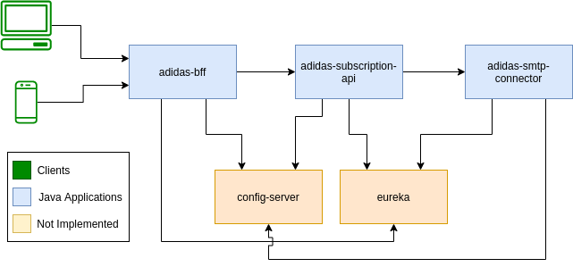

# Adidas Challenge

Developed challenge with microservice approach using Java + SpringBoot Stack.

### Architecture
<br>



### Running the environment

```
sh run.sh
```

### Check the containers

```
docker ps
```

### Applications

* Adidas BFF - https://github.com/leonardo-mendes/adidasChallenge/tree/master/adidas-bff
* Adidas Subscription API - https://github.com/leonardo-mendes/adidasChallenge/tree/master/adidas-subscription-api
* Adidas SMTP Connector - https://github.com/leonardo-mendes/adidasChallenge/tree/master/adidas-smtp-connector