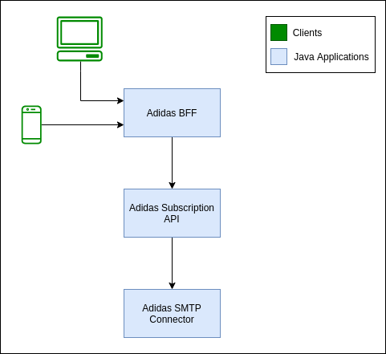

# Adidas Challenge

Developed challenge with microservice approach using Java + SpringBoot Stack.

### Architecture
<br>



### Running the environment

```
sh run.sh
```

### Checking the containers

```
docker ps
```

### Cleaning the local environment

```
sh cleanEnvironment.sh
```

### Using the applications

* Adidas BFF - https://bit.ly/3lODdJ1
* Adidas Subscription API - https://bit.ly/3sacp7m
* Adidas SMTP Connector - https://bit.ly/3An5OsR
